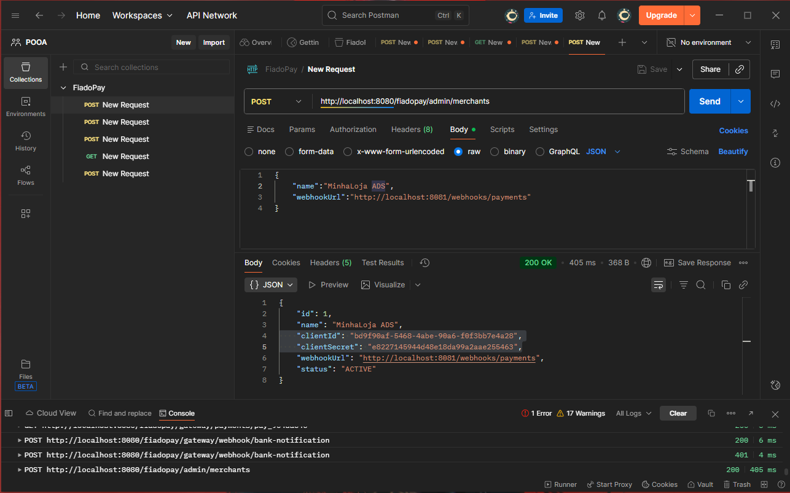
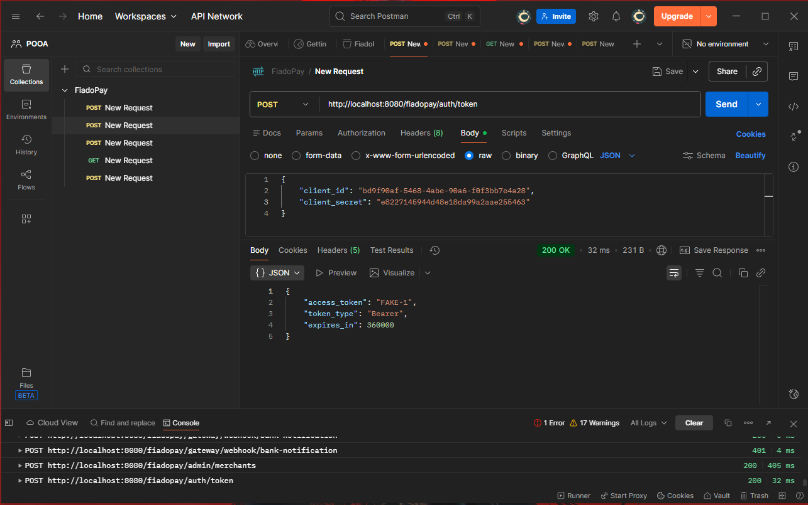
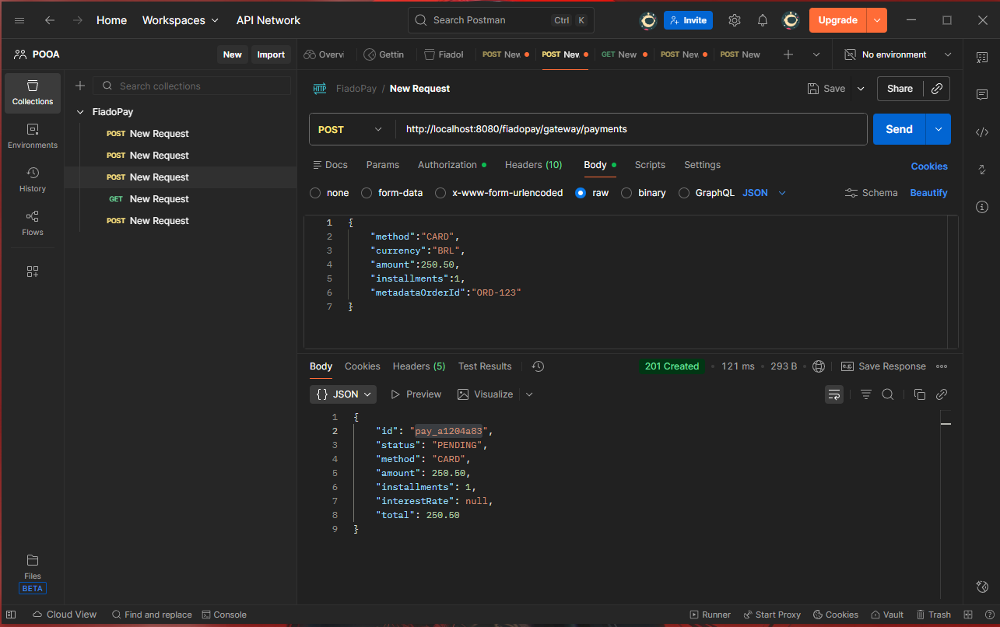
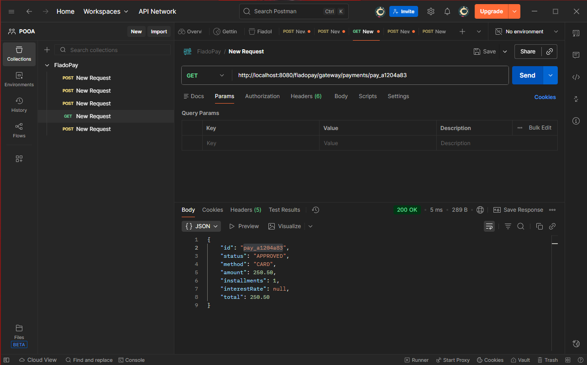
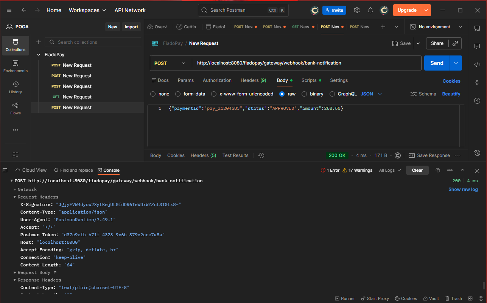

# FiadoPay Simulator (Spring Boot + H2)

## Participantes
Bernardo Megale Amorim
Marcelo Barros Silva Filho
Matheus Haig Franca Silva
Gateway de pagamento **FiadoPay** para a AVI/POOA.
Substitui PSPs reais com um backend em memória (H2).

## Rodar
```bash
./mvnw spring-boot:run
# ou
mvn spring-boot:run
```

H2 console: http://localhost:8080/h2  
Swagger UI: http://localhost:8080/swagger-ui.html

## Fluxo

1) **Cadastrar merchant**
```bash
curl -X POST http://localhost:8080/fiadopay/admin/merchants   -H "Content-Type: application/json"   -d '{"name":"MinhaLoja ADS","webhookUrl":"http://localhost:8081/webhooks/payments"}'
```

2) **Obter token**
```bash
curl -X POST http://localhost:8080/fiadopay/auth/token   -H "Content-Type: application/json"   -d '{"client_id":"<clientId>","client_secret":"<clientSecret>"}'
```

3) **Criar pagamento**
```bash
curl -X POST http://localhost:8080/fiadopay/gateway/payments   -H "Authorization: Bearer FAKE-<merchantId>"   -H "Idempotency-Key: 550e8400-e29b-41d4-a716-446655440000"   -H "Content-Type: application/json"   -d '{"method":"CARD","currency":"BRL","amount":250.50,"installments":12,"metadataOrderId":"ORD-123"}'
```

4) **Consultar pagamento**
```bash
curl http://localhost:8080/fiadopay/gateway/payments/<paymentId>
```

5) **Validar recebimento**
```bash
curl -X POST http://localhost:8080/fiadopay/gateway/webhook/bank-notification   -H "X-Signature: <HMAC>"  -H "Content-Type: application/json"   -d '{"paymentId":"<id>","status":"<status>","amount":<total>}'
```

OBS: Site para gerar o HMAC - https://www.authgear.com/tools/hmac-signature-generator-verifier
prencha os campos com a secret key e com o json correspondente(Ex: {"paymentId":<id>,"status":<status>,"amount":<amount>})

---
## Contexto e Objetivos

O FiadoPay é um gateway de pagamentos simplificado utilizado na disciplina para demonstrar conceitos essenciais de engenharia de software moderna, como:

* plugins dinâmicos,
* antifraudes configuráveis,
* métodos de pagamento plugáveis,
* webhooks assíncronos,
* arquitetura orientada a serviços,
* boas práticas com Java 21+ e Spring.

O objetivo deste trabalho é refatorar e aprimorar o FiadoPay mantendo o contrato de API existente, garantindo:

* autenticação fake,
* idempotência das operações,
* cálculo de juros de 1% a.m. para pagamentos parcelados,
* envio de webhook assinado com o cabeçalho X-Signature.

Além disso, a proposta envolve reforçar práticas de engenharia, modularização, extensibilidade e processamento assíncrono, tornando o sistema mais robusto e organizado.

## Tecnologias Utilizadas

* **Java 21**
* **Spring Boot 3**
* **Maven**
* **H2 (in-memory)**
* **ExecutorService** (para processamento assíncrono)
* Plugins implementados com **anotações e reflexão**
* API documentada via **Swagger/OpenAPI**

## Arquitetura do Projeto

A estrutura segue o padrão:

```
edu.ucsal.fiadopay
 ├── annotations/       → Anotações personalizadas
 ├── plugins/           → Implementações de PaymentMethods, AntiFrauds e WebhookSink
 ├── service/           → Serviços principais, com ExecutorService
 ├── controller/        → Endpoints REST
 ├── repo/              → Repositórios Spring Data
 ├── domain/            → Entidades
 └── config/            → Configurações (OpenAPI, Async, etc.)
```

Princípios aplicados:

* SRP (Single Responsibility)
* Baixo acoplamento
* Plugins desacoplados do core
* Concorrência isolada no serviço

## Anotações Criadas
| Anotação                                                                                                               | Metadados                                                                                                                                                           | Resumo                                                           |
| ---------------------------------------------------------------------------------------------------------------------- | ------------------------------------------------------------------------------------------------------------------------------------------------------------------- | ---------------------------------------------------------------- |
| **@AntiFraud(threshold = ...)**                                                                                        | `threshold` = limite     		                                                                                                                               | Define uma regra de antifraude descoberta por reflexão.          |
| **@RequeridoSeValorIgual(campoGatilho = ..., valorQueDisparaObrigatoriedade = ..., campoQueSeTornaObrigatorio = ...)** | `campoGatilho` = campo gatilho, `valorQueDisparaObrigatoriedade` = valor que dispara Obrigatoriedade, `campoQueSeTornaObrigatorio` = campo que se torna obrigatorio.| O campo se torna obrigatorio se o valor de outro campo for igual.|

---
As anotações definem metadados usados para identificar plugins de pagamento, antifraude e webhook. No startup, o sistema lê essas anotações via reflexão e registra automaticamente os plugins no PluginRegistry, permitindo adicionar novas funcionalidades sem alterar o código principal.


## Threads & Concorrência

| Componente                                 | Descrição                                                                                     |
| ------------------------------------------ | --------------------------------------------------------------------------------------------- |
| **Processamento assíncrono de pagamentos** | O pagamento é colocado em uma fila interna e processado em background por um pool de threads. |
| **Envio assíncrono de webhook**            | Após o pagamento ser aprovado ou recusado, o webhook é enviado em segundo plano.              |
| **Pool de threads**                        | ExecutorService configurado com pool fixo para garantir estabilidade e previsibilidade.       |
| **Tratamento de rejeições**                | Falhas no agendamento ou execução são tratadas e logadas.                                     |
| **Isolamento de tasks**                    | Cada etapa (processamento e webhook) roda isolada, evitando blocos na API.                    |

A aplicação executa pagamentos e webhooks de forma assíncrona utilizando um ExecutorService, garantindo fluidez e desacoplamento entre API e processamento interno.

## Padrões Aplicados

| Padrão                                    | Onde foi aplicado                           | Benefício                                                                                  |
| ----------------------------------------- | ------------------------------------------- | ------------------------------------------------------------------------------------------ |
| **SRP (Single Responsibility Principle)** | Services, Controllers, Plugins              | Mantém cada classe com uma única responsabilidade, facilitando manutenção.                 |
| **Observer / Event-driven**               | Disparo de webhooks após processamento      | Desacopla a API do envio do webhook.                                                       |
| **Asynchronous Processing**               | ExecutorService para pagamento e webhook    | Evita bloqueio na API e melhora performance.                                               |
| **Layered Architecture**                  | Controller → Service → Repository           | Organização limpa e separação de responsabilidades.                                        |
| **Reflection-based Discovery**            | PluginScanner lendo anotações               | Plugins são detectados automaticamente no startup.                                         |


---

## Limitações Conhecidas

* H2 é volátil (reinicia a cada execução)
* Plugins exigem classes públicas
* Webhook local precisa de ferramenta como webhook.site ou ngrok

---

## Prints










